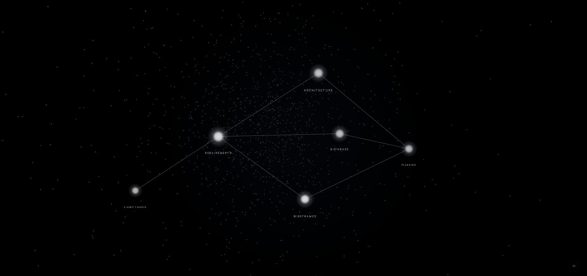

# Constellation - Hoobit 2026 Submission

Constellation is my interpretation of what it means to reimagine the way we interact with AI. I find that the current way we interact with generative AI is quite rudimentary.

If you're anything like me, you never go back and read the chats left by AI after my first initial skim that idea is lost forever. There is too much text and the UI/UX does not feel like we are living in the age of AI. That's why I decided to build Constellation, a spatial environment where ideas are organised and interactive.

It's currently only implemented for software engineers to use while designing and planning applications, but I believe it's a step forward in the right direction to revolutionise the way we interact with AI. Right now it only focuses on changing the way AI output is presented with little to no interaction from the user, but the conversational aspect will be explored in the future.



# Installation & Setup

After you clone the Repo:

1. Install.
    ``` 
    npm install
    ```

2. Run it in two terminals.

    Terminal 1:
    ``` 
    npm run dev
    ```

    Terminal 2:
    ```
    npm run server:mock     # fixture content, no API key needed, works offline
    npm run server          # live Claude generation — needs the key (step 3)
    ```

3. Only for live mode - create server/.env
    ```
    ANTHROPIC_API_KEY=sk-ant-...
    ```

# Tech Stack

## Frontend
- React 19 + Vite
- React Three Fiber + three.js
- @react-three/drei
- Plain CSS

## Backend
- Node + Express
- @anthropic-ai/sdk
- dotenv

## AI
- claude-sonnet-5  

# AI Disclosure

After the initial brainstorming session I used AI to clarify and solidify my idea. 

Generative AI was also heavily used throughout coding as all code is AI generated which I am not proud to say. 

Also helped do a final spell and grammar check of this readme. 

Generative-AI is also used inside the app to help generate the content inside the nodes. 

# Final Notes

Application is currently only for desktop. 